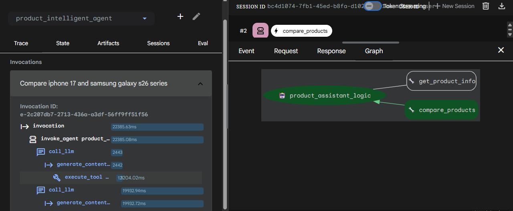
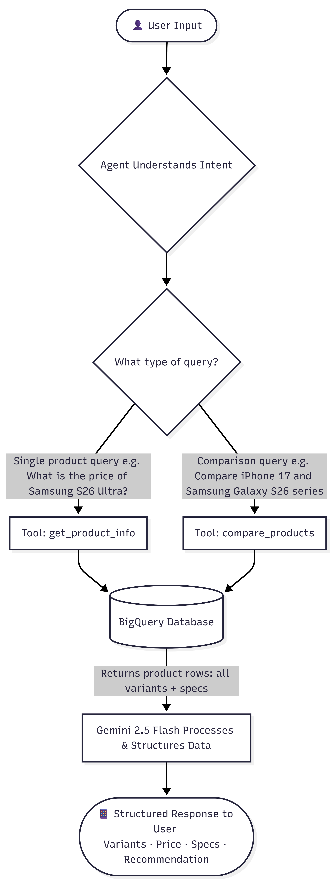
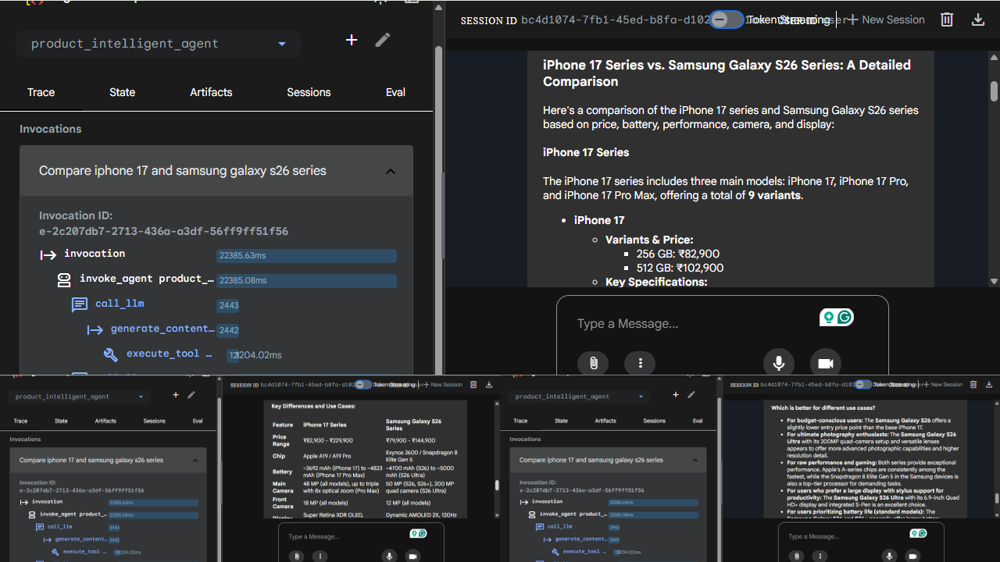
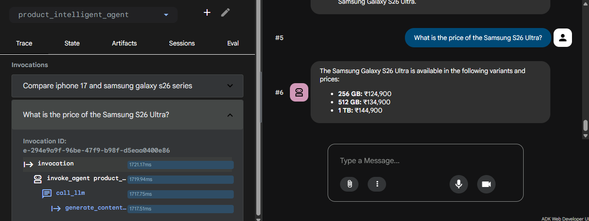

# **Product Intelligent Agent Built with Google ADK, BigQuery & Cloud Run**
# **Introduction**
This project builds and deploys a **Product Intelligent Agent** on **Cloud Run** that leverages **Google ADK** and **Gemini** to query a **live BigQuery** dataset, providing accurate, real-time product information and structured comparisons to simplify the consumer decision-making process.

# **The Product Intelligent Agent**
The Product Intelligent Agent understands the user’s intent intelligently. Whether the user wants to retrieve detailed specifications for a single device, check variant-wise pricing, or compare entire series across two different brands, the agent identifies the intent correctly and calls the appropriate tool.

## **The agent handles two core capabilities:**

1. **Single Product Lookup:** Retrieves all variants, specifications, and pricing for a mobile device.
2. **Product Comparison:** Compares two devices across price, battery, performance, camera, and display.

## **For Example:**
➡️ When a user asks ***"Compare iPhone 17 and Samsung Galaxy S26 series"***, the agent recognises this as a full series comparison and retrieves all variants across both brands, comparing them across price, battery, performance, camera, and display.

➡️ When a user asks ***"What is the price of the Samsung S26 Ultra?"***, the agent retrieves pricing for every available **storage variant: 256GB, 512GB, and 1TB**, giving the user a complete picture rather than a single number.

# **Product Intelligent Agent Workflow**

  

  

✅ **Intent Recognition:** The agent receives the user's input and utilizes Gemini to classify the intent (e.g., a single product lookup vs. a multi-product comparison).

✅ **Dynamic Tool Selection:** Based on the intent, the agent selects from two custom Python-based tools:

| **Tool**              | **Purpose**                                                   |
|-------------------|-----------------------------------------------------------|
| ➡️ **`get_product_info`** | Detailed specs and all pricing variants of a specific model |
| ➡️ **`compare_products`** | Side-by-side analysis of different product series          |

✅ **Database Grounding:** The Python tools execute queries against the BigQuery dataset, ensuring the response is grounded in facts.

✅ **Data Processing:** The raw product rows returned from BigQuery are processed by Gemini, which parses the specifications and pricing into a readable format.

✅ **Structured Output:** The final response is delivered to the user, including properly grouped variants and key technical differences.

# **Agent's Response**
## **Deep-Context Comparisons**

  

➡️ **Integrated Trace Logging:** The left panel demonstrates the invocation lifecycle, the agent's ability to trigger the compare_products tool and execute backend data retrieval.

➡️ **Structured Technical Breakdown:** The center-right panel highlights the agent's capacity to deliver a detailed comparison across **Price, Battery, Performance, Camera, and Display.**

➡️ **In-Depth Feature Analysis:** Rather than a simple list, the agent identifies **Key Differences** between model tiers using a structured table format.

➡️ **Use-Case Recommendation:** The final output provides actionable insights by tailoring recommendations to specific personas, such as **budget-conscious users, mobile photographers, and productivity power-users.**

## **Precise Variant Retrieval**

 

➡️ **Granular Data Mapping:** The agent demonstrates its ability to retrieve and display all available storage variants (256GB, 512GB, 1TB) for a single model in a clean, bulleted format.

# **Differentiation, Problem-Solving, and Unique Value Proposition**
Most AI bots guess prices, but this agent is connected to a BigQuery database using custom ADK tools, ensuring every response is grounded in real, verified records.

| **What Makes it Unique**     | **Detail**                                                                                                                                           |
|---------------------------|-------------------------------------------------------------------------------------------------------------------------------------------------|
| Intent-Aware Grounding    | The agent identifies user intent by leveraging **ADK’s tool-calling architecture** and maps it to specific **SQL tools**. When the intent falls outside the scope of the BigQuery dataset, the agent responds transparently with a clear ***"data not found"*** message. |
| Structured Precision      | Handles complex variant logic (e.g., distinguishing 256GB vs. 1TB pricing) and presents results in a clear, standardized format.                |
| Live Data Grounding       | Responses come from BigQuery, not model memory.                                                                                                 |
| Contextual Comparison     | It doesn't just list specs; it interprets them (e.g., explaining why one chip is better for **"heavy multitasking" vs. "ecosystem efficiency").**   |
| Extensible Design         | New product categories, brands, or tools can be added without rebuilding the agent, and the same concept can be applied to different niches.     |

# **Technologies used in the Solution**
## **Core Framework & AI:**
- **Google ADK (Agent Development Kit):** Used for agent orchestration, state management, and tool-calling logic.
- **Vertex AI:** The enterprise platform used to deploy and manage the generative AI lifecycle.
- **Gemini 2.5 Flash:** The **"Reasoning Engine"** used for intent classification and data parsing
- **Python 3.12:** The core programming language used to build the agent logic and data retrieval tools.

## **Data & Storage**
- **Google BigQuery:** Serving as the centralized data warehouse. 
- **SQL (Standard SQL):** Used within Python functions to perform precise filtering and retrieval of product data.

## **Cloud Infrastructure & Deployment**
- **Google Cloud Run:** A serverless platform used to host the agent's HTTP endpoint and the ADK Web UI.
- **Google Cloud Shell:** The development environment used for building, testing, and deploying the containerized application.
- **Docker:** Used (via the ADK/Cloud Run integration) to containerize the application for consistent deployment.

## **Enabled APIs**
- run.googleapis.com
- artifactregistry.googleapis.com
- cloudbuild.googleapis.com
- aiplatform.googleapis.com
- compute.googleapis.com
- bigquery.googleapis.com

    
